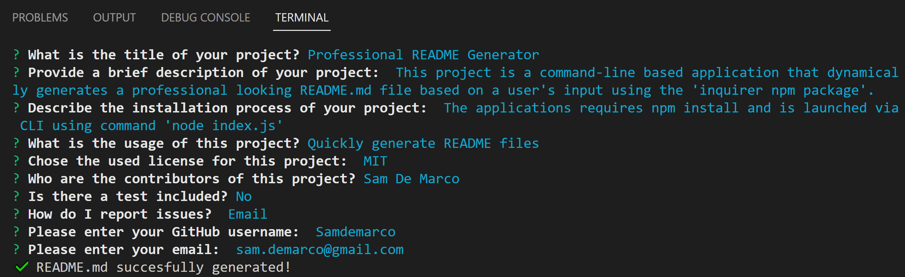

<h1>09 Node.js Challenge: Professional README Generator </h1>
  
  <br />
  
  Here is a snapshot of the application:

  
  ## Description
   This project is a command-line based application that dynamically generates a professional looking README.md file based on a user's input using the 'inquirer npm package'.
   
   ## Challenges

Overall this was a pretty straight forward assignment with the one exception of properly being able to generate the correct URL License links. I wanted to ensure that once a user selected a specific license that I could also provide a URL link to that license however, I couldn't use a simple 1:1 insertion of say 'Mozilla' into the URL since the actual text designator in the URL for Mozilla is 'MPL-2.0' (https://opensource.org/licenses/MPL-2.0).  
   
## User Story

```
AS A developer
I WANT a README generator
SO THAT I can quickly create a professional README for a new project

```

## Acceptance Criteria

```
GIVEN a command-line application that accepts user input
WHEN I am prompted for information about my application repository
THEN a high-quality, professional README.md is generated with the title of my project and sections entitled Description, Table of Contents, Installation, Usage, License, Contributing, Tests, and Questions
WHEN I enter my project title
THEN this is displayed as the title of the README
WHEN I enter a description, installation instructions, usage information, contribution guidelines, and test instructions
THEN this information is added to the sections of the README entitled Description, Installation, Usage, Contributing, and Tests
WHEN I choose a license for my application from a list of options
THEN a badge for that license is added near the top of the README and a notice is added to the section of the README entitled License that explains which license the application is covered under
WHEN I enter my GitHub username
THEN this is added to the section of the README entitled Questions, with a link to my GitHub profile
WHEN I enter my email address
THEN this is added to the section of the README entitled Questions, with instructions on how to reach me with additional questions
WHEN I click on the links in the Table of Contents
THEN I am taken to the corresponding section of the README

```
   
  ## Table of Contents
  - [Description](#description)
  - [Installation](#installation)
  - [Usage](#usage)
  - [License](#license)
  - [Contributors](#contributors)
  - [Tests](#tests)
  - [Questions](#questions)
  ## Installation
   The applications requires npm install and is launched via CLI using command ```node index.js```
  ## Usage
   Quickly generate README files
  ## License
  
  <br />
  MIT License URL:   https://opensource.org/licenses/MIT. 
  ## Contributors
   Sam De Marco
  ## Tests
   No
  ## Questions
   Email<br />
  <br />
  My GitHub: [Samdemarco](https://github.com/Samdemarco)

  Contact me via email for any issues: sam.demarco@gmail.com<br /><br />
      
